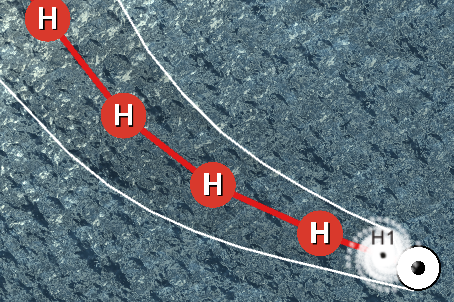
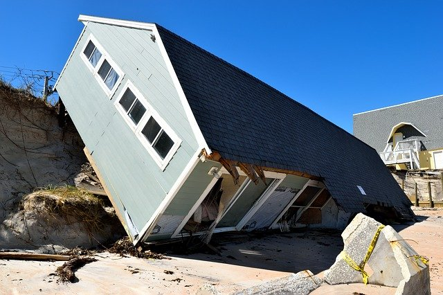

    <section class="center">
        <h2 id="Feature1">Hurricanes based on real-life data</h2>
        
        
Displacement of hurricanes based on data from past Atlantic hurricane seasons obtained from the Google Cloud Platform database. Hurricane category evolution prediction information and trajectory cone prediction information obtained from the National Hurricane Center database.

    </section>
    <section class="center">
        <h2 id="Feature2">Realistic populational damages</h2>
        
        
Damage to regions based on data collected from the Emergency Events Database (EM-DAT), along with damage models obtained from scientific articles:<a href="https://doi.org/10.1111/poms.13053">Collaborative Prepositioning Network Design for Regional Disaster Response</a> and <a href="https://doi.org/10.1111/poms.13403">A Cost-Sharing Mechanism for Multi-Country Partnerships in Disaster Preparedness</a>

    </section>
    <section class="center">
        <h2 id="Feature3">Data collection tool</h2>
        
        
The game collects information from players' disaster preparedness and response decisions, along with their study, work, and gaming experience information. This allows studies on the decision process of different types of players and identification of different strategies and their outcomes.

    </section>

