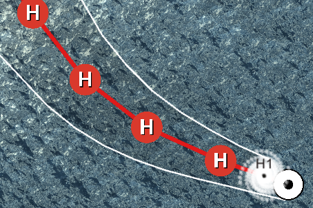
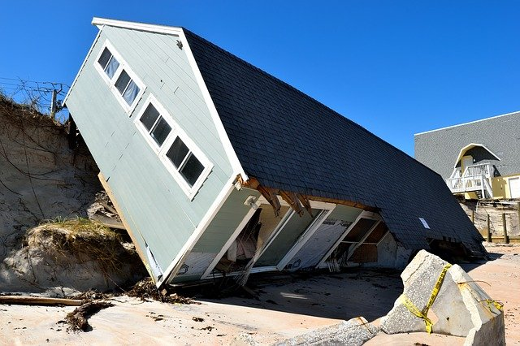

    <section class="center">
        <h2 id="Feature1">Ouragans basés sur des données réelles</h2>
        
        
Déplacement des ouragans basé sur des données des saisons passées d'ouragans de l'Atlantique obtenues de la base de données de la plateforme Google Cloud. Informations sur la prédiction de l'évolution de la catégorie des ouragans et sur la prédiction du cône de trajectoire obtenues de la base de données du National Hurricane Center database.

    </section>
    <section class="center">
        <h2 id="Feature2">Dommages réalistes</h2>
        
        
Dommages aux régions basés sur des données collectées à partir de la base de données des événements d'urgence (EM-DAT), ainsi que sur des modèles de dommages obtenus à partir d'articles scientifiques : <a href="https://doi.org/10.1111/poms.13053">Collaborative Prepositioning Network Design for Regional Disaster Response</a> et <a href="https://doi.org/10.1111/poms.13403">A Cost-Sharing Mechanism for Multi-Country Partnerships in Disaster Preparedness</a>

    </section>
    <section class="center">
        <h2 id="Feature3">Outil de collecte de données</h2>
        
        
Le jeu collecte des informations sur les décisions des joueurs en matière de préparation et de réponse aux catastrophes, ainsi que des informations sur leur expérience d'étude, de travail et de jeu. Cela permet des études sur le processus décisionnel de différents types de joueurs et l'identification de différentes stratégies et de leurs résultats.

    </section>

