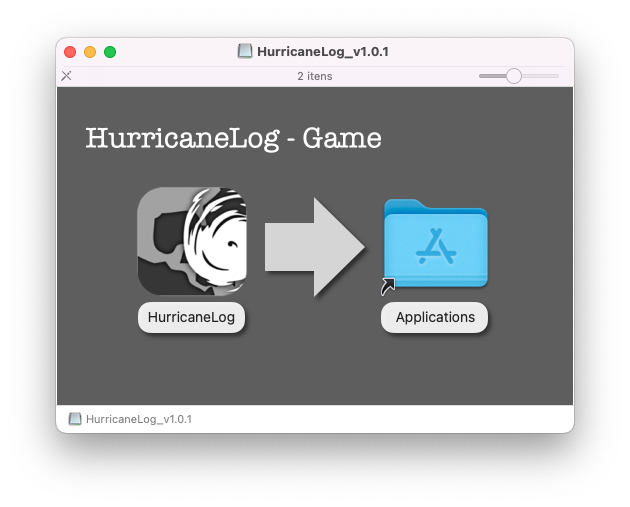
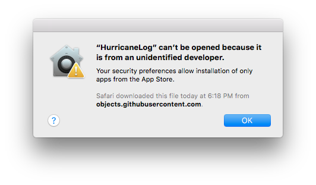
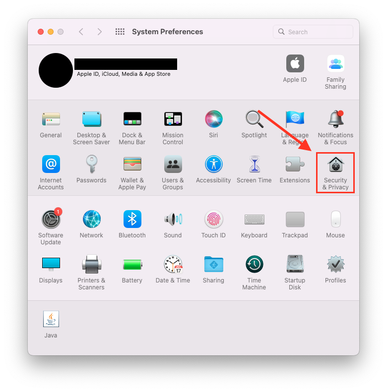
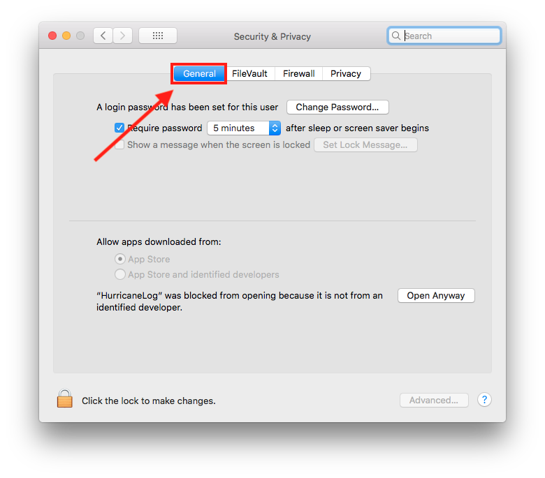
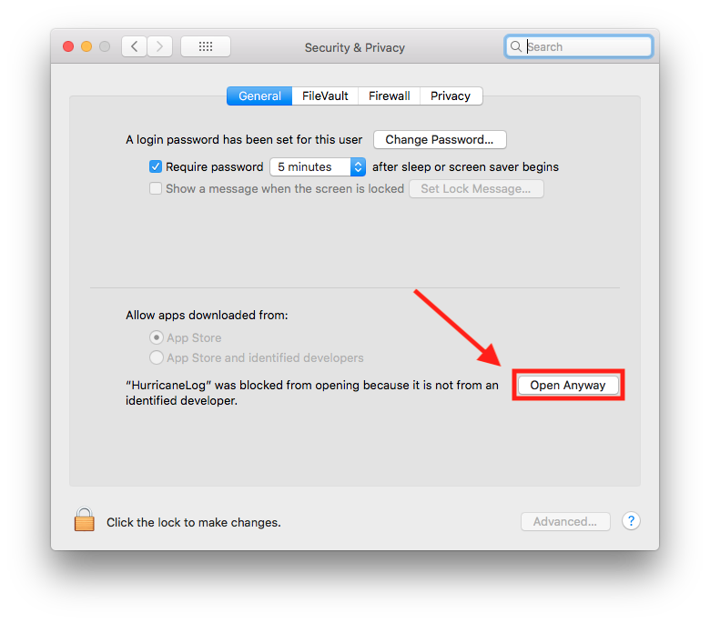
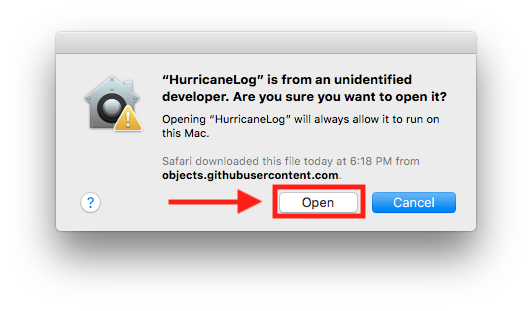
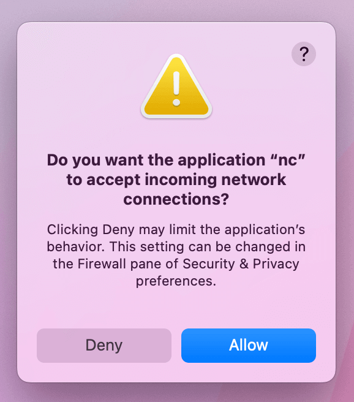

# Table des matières
1. [Installation sous Windows](#windows)
2. [Installation sous macOS](#macOS)
3. [Installation sous Linux](#linux)

## Installation sous Windows 
1. Téléchargez et exécutez le fichier `.exe`.
2. Suivez le processus d'installation. Il peut demander d'installer DirectX ou Visual C++ Redistributable. Ils sont nécessaires au bon fonctionnement du jeu.
3. Après l'installation, lancez le jeu.

## Installation sous macOS 
1. Téléchargez et ouvrez le fichier `.dmg`.
2. Faites glisser le fichier HurricaneLog et déposez-le dans le dossier Applications.

3. Lancez le jeu.

### Si l'avertissement suivant apparaît

Suivez les instructions :

1. Ouvrez les **Préférences Système**
2. Cliquez sur **Sécurité et confidentialité** 

3. Cliquez sur l'onglet **Général** 

4. Cliquez sur l'option **Autoriser quand même** 

5. Cliquez sur le bouton **Ouvrir** 

### Si l'avertissement suivant apparaît

1. Cliquez sur **autoriser**.

Si vous rencontrez un avertissement différent, veuillez consulter le <a href="https://support.apple.com/fr-ca/HT202491">guide *Ouvrir les apps en sécurité* d'Apple</a>.

## Installation sous Linux 

Extrayez le jeu du fichier `.zip` et exécutez le jeu.

Si le jeu ne démarre pas, essayez l'une des commandes suivantes dans votre terminal :
- `./HurricaneLog_v1.1.0_Linux.x86_64 -force-opengl`
- `./HurricaneLog_v1.1.0_Linux.x86_64 -force-glcore`

**Note :** Vous devrez mettre à jour la version du jeu en ligne de commande si vous utilisez une version autre que `v1.1.0`.

