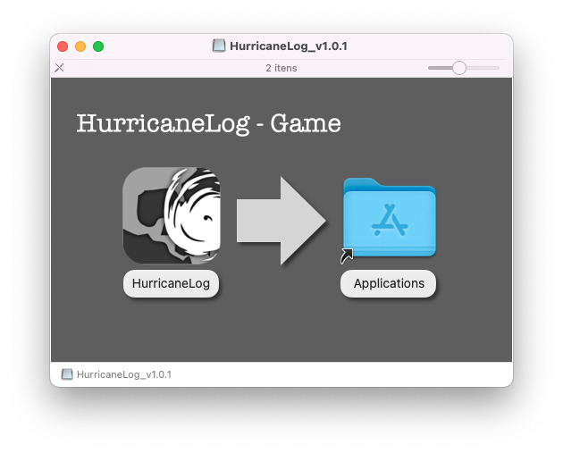
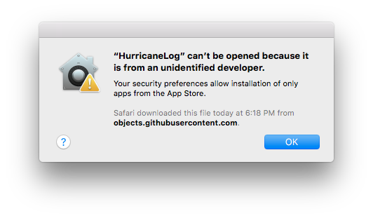
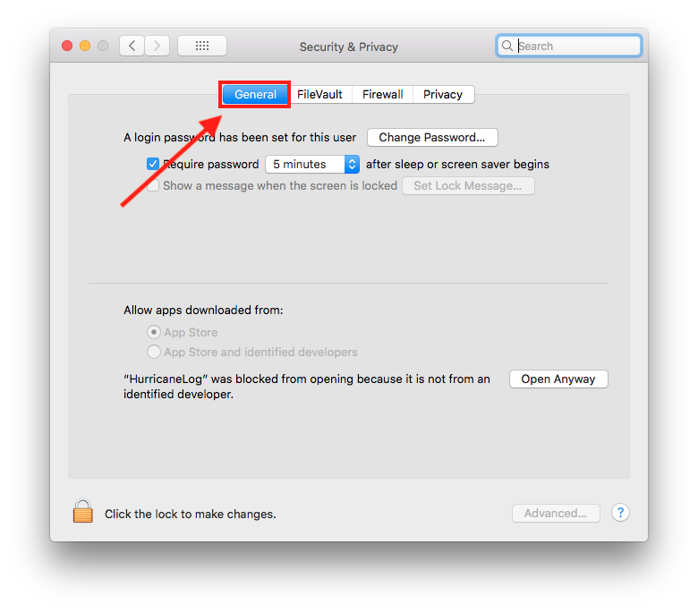
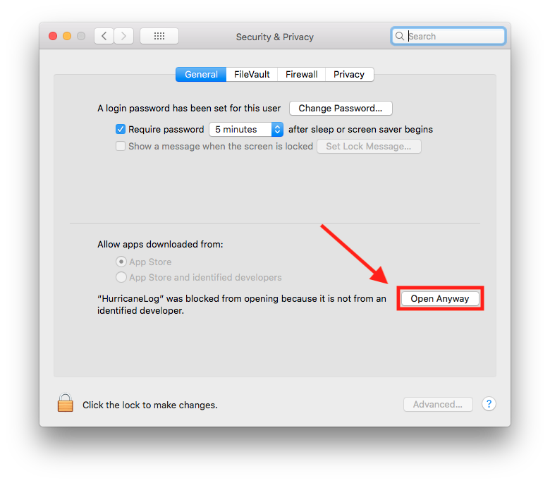
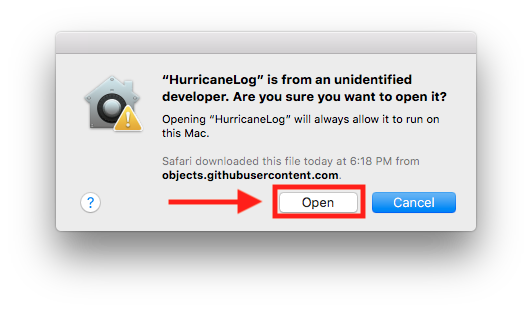

# Table of contents
1. [Windows Installation](#windows)
2. [macOS Installation](#macOS)
3. [Linux Installation](#linux)

## Windows Installation 
1. Download and execute the `.exe` file.
2. Follow the installation setup. It might ask to install DirectX or Visual C++ Redistributable. They are necessary to the game functioning.
3. After installing, execute the game.

## macOS Installation 
1. Download and open the `.dmg` file.
2. Drag the HurricaneLog file and drop into the Applications folder.

3. Execute the game.

### If the following warning appears

Follow the instructions:

1. Open the **System Preferences**
2. Click on **Security and Privacy** 

3. Click on the tab **General** 

4. Click on the option **Allow Anyway** 

5. Click on the **Open** button 

### If the following warning appears

1. Click on **allow**.

Case you face a different warning, please refer to <a href="https://support.apple.com/en-ca/HT202491">Apple's *safely open apps* guide</a>

## Linux Installation 

Extract the game from the `.zip` file and execute the game.

Case the game doesn't start, try one of the following commands in your terminal:
- `./HurricaneLog_v1.0.2_Linux.x86_64 -force-opengl`
- `./HurricaneLog_v1.0.2_Linux.x86_64 -force-glcore`

**Note:** You will need to update the game version on the command line if you are using other than `v1.0.2`
